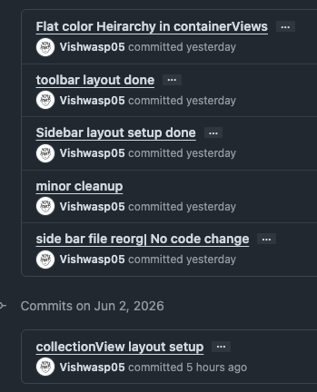
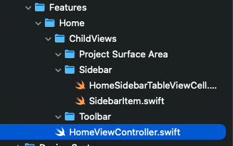

Greetings,

Let me address the elephant in the room: writing code manually sucks. The closest thing it reminds me of is the Paramilitary Eligibility week. It's messy, muddy, gruelling, and you're kept awake and still made to perform cognitively demanding tasks. (I'm just drawing parallels; they obviously have it exponentially tougher experience).

Most of it, however, is of my own doing. I've allowed myself to create vague connections between how software works and expose myself to a side of tech way(-yyyy) above my grade. That's a dangerous concoction when AI tools cover the gaps in understanding.

It's like how you gaslight yourself one night before exams, quickly skim 30-40% of the book, tell yourself you know it, and then go to sleep. Same. 100%. Or another example (wow, so many examples today :D) writing an `O(n³)` algorithm and running it on insanely overpowered hardware and very light test cases. On paper, everything works; you have the right output, there's no observable lag.

But there's a fundamental issue with this: the hardware and light test cases, to an untrained eye, such as mine, mask the issues, areas of improvement, and the absurdity of it all. It's not about being a performance enthusiast obsessing over 0.01ms of improvements and going mental, but not knowing about these gaps in the first place robs me of the opportunity to build the *"trade-off"* mental model and take conscious decisions about what, when, where, how, how much, and most importantly, why use something over another.

I mean, isn't that the distinction between a script kiddie and a software engineer - the ability to explain, reason, defend your reasoning for something as opposed to a handcrafted solution presented on a silver platter, right?

---

Now, in the past 4 days, I've been writing code manually. My mind, instinctively, is typing away to a *"modular"* *"reusable"* code, and after 2/3 hours of writing something, I run it only for it to just poop its pants (in front of everyone).

It is there, I've had a (rather painful) epiphany that I'm skipping steps (the gaps I talk of above, start to appear) (They'd be masked by AI tools earlier). So now I have a bunch of code - neatly separated in files, folders, and the whole array of *"clean"* stuff (for the lack of a better word). Cool? NOT COOL. The one thing it's supposed to do, it doesn't do it. Not very well. Not average. It just doesn't work.

And this reminded me of something I've been doing - playing a tug of war with code. Wrestling with it. Write some spaghetti, ask AI to fix *"Here's a screenshot, here's what it needs to do,"* and carry on with the day. Not that there's something inherently wrong with this, but unless I can reason about my code, it's not my code. And with that, I'm at the mercy of the tool, which, btw, is such a gaslighter. Have you noticed? Same prompt, and I ask, *"Are you sure?"* and completely backtracks (BRUH?)

---

Now coming to the second problem ✨Version Control System✨ (I use Git, btw). Honest confession - I treat it as a code dump at best. You can't backtrack progress with a small change in surface area in my commits. You don't know 4W2H of my commits. It's just *"User Logout done"*. That's it. I can't rollback to a specific atomic task on this. It's 3-4 (oftentimes more) parts of code changed together in a way that I can't rollback one highly specific functionality.

---

So in the last 3/4 days, I've taken the liberty to make it my mission to learn 2 things:

1. Recursive Task Breakdown
2. Version Control like Software Gods intend to (it's not what you think)

If you think closely, both these problems, in a way, are complementary. Sorry 2 birds :(. I don't have a list of systematic tasks that, when done one after another, produce the desired feature. So all I can commit is one giant mess of a commit (not absolving myself of the carelessness by any stretch of imagination).

---

So this time, while building the HomeViewController.swift I just raw-dogged it. Suck it, *"Clean code"* gurus. Two ways to break tasks. No premature file/folder creation. One single file.

The second axis was to break things in terms of their respective outcome. View Layout code doesn't care about anything but the positioning of the views. Networking code doesn't care about where it's being consumed - only *"I talk to server, I return data"*.

So, with that in mind, I broke down the home screen in terms of UI/ UX/ Business logic. In UI its hierarchy / actual controls / connecting said controls to dummy actions / for UX its about making connecting the UI to the functions that control/drive its output, refining animations and ironing out any obvious hiccups in the way the UI feels. Finally, in Business logic, writing different managers, with clear separation of concerns and abstractions wherever applicable.

---

The second thing is not making files before the code works. I really need to avoid this. So what I've been doing in the past 3 days is to write all my code in one place. After each layout is completed, commit it with a meaningful message and description (strictly both explaining everything done). This allows me to rollback to any specific instance with actual context (message/description).

Only then do I do any new file creation, separation, or introduce abstraction. And for a feature that'd take me 30 mins to one-shot with Claude, has just finished its layout in plain UIView, not even actual controls 😭🙏🏻. But I'm going to endure this; it has painstakingly made it clear to me the gaps in my understanding, which to me is invaluable.

---

Since then, a friend has pointed out that I make it a point not to use AI to even debug non-code-related issues, which, in all fairness, is a good ask, and I'll try not to. *"Bulati hai, magar jane ka nahi"* (popular Hindi pop culture meme -> She calls, but don't go, she being a ghost).

This is what my layout looks like. This is what my commits look like, and this is what my project structure looks like.

*Just flat color based bare layout does nothing*

*Now my commit history is somewhat trackable*

*After all this, this is what my file structure looks like*

---

## Learnings this time around:

- Elegance in code is important, but not before its needs are warranted
- Don't completely build the living room, while the rest of the house is missing (or in tatters); build incrementally
- Use VCS for what it is and not just a code dump
- Write in one file, elegant organized code doesn't mean shit if it doesn't work :(
- Talk to friends, check up on them. Touch grass

---

*Until we meet again,*

*Goodbye*
